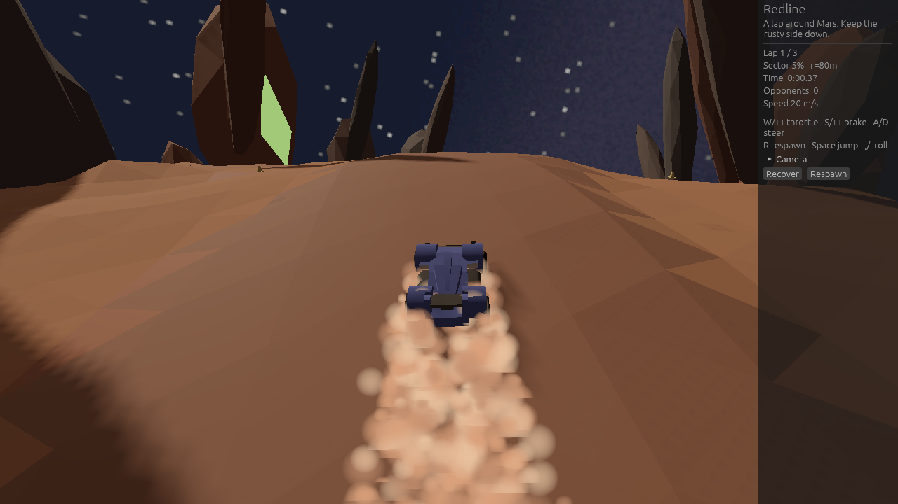

# Redline

Race around a procedurally generated planet. Mars is the first circuit.

Play in the browser: <https://kvark.github.io/redline/>



## Run

Models are stored in Git LFS:

```sh
git lfs install
git lfs pull
cargo run --release
```

Interactive runs open a pre-race egui menu to pick a vehicle and circuit; Start
Race begins the lap. `--script` / `--smoke` (and WASM query scripts) skip the menu
and boot straight into the drive, same as before.

The vehicle is a Rapier joint graph (chassis, four wheels, suspenders). Debug
builds of that solver are much slower than `--release`; use release for playable
framerate.

Optional ray-traced lighting (needs RT hardware):

```sh
REDLINE_RT=1 cargo run --release
```

Headless smoke test (used by Linux CI):

```sh
# debug — catches assertion failures that --release strips
xvfb-run -a cargo run -- --smoke 20
xvfb-run -a cargo run --release -- --smoke 20
```

Scripted drive traces (writes CSV and a log summary, then exits):

```sh
xvfb-run -a cargo run --release -- --script accel --seconds 8
xvfb-run -a cargo run --release -- --script steer --seconds 8
xvfb-run -a cargo run --release -- --script offroad --seconds 12
xvfb-run -a cargo run --release -- --script lap --seconds 12 --record /tmp/redline-lap.csv
xvfb-run -a cargo run --release -- --script race --seconds 120 --record /tmp/redline-race.csv
```

Scripts: `accel` (straight throttle), `steer` (hold left), `offroad` (leave the ribbon then return), `lap` (follow the track until a lap completes, no AI), `race` (same driving with AI opponents through 3 laps / `laps_to_win`). Default CSV path is `/tmp/redline-<script>.csv`.

Physics uses a fixed 10 ms step with catch-up so lavapipe, a real GPU, and WebGL2 share the same controls/joints regardless of frame time. Scripted runs catch up aggressively so a full lap finishes in seconds of wall time under software raster.

On the web build, the same scripts are available via query string, e.g. `?script=lap&seconds=45` or `?script=race&seconds=120`.

## Web / WASM

Requires a WebGL2 browser. Assets are embedded at compile time. `.cargo/config.toml`
sets `--cfg gles` for `wasm32`, which Blade needs so the shadow pipeline includes
a fragment shader (WebGL cannot link a vertex-only program).

```sh
rustup target add wasm32-unknown-unknown
cargo install wasm-bindgen-cli
cargo build --release --target wasm32-unknown-unknown
wasm-bindgen --target web --no-typescript --out-dir dist/pkg \
    target/wasm32-unknown-unknown/release/redline.wasm
cp web/index.html dist/index.html
python3 -m http.server --directory dist
```

Pushes to `main` build the WASM target and deploy it to GitHub Pages.

Controls: `W/↑` throttle, `S/↓` brake, `A/D` steer, `R` respawn, `Space` jump, `,/.` roll, `Esc` opens the menu while racing (quit from the menu on native).

Kenney models are CC0; licenses are in `assets/licenses/`. Generated planet meshes go to `assets/generated/` and are not committed.
